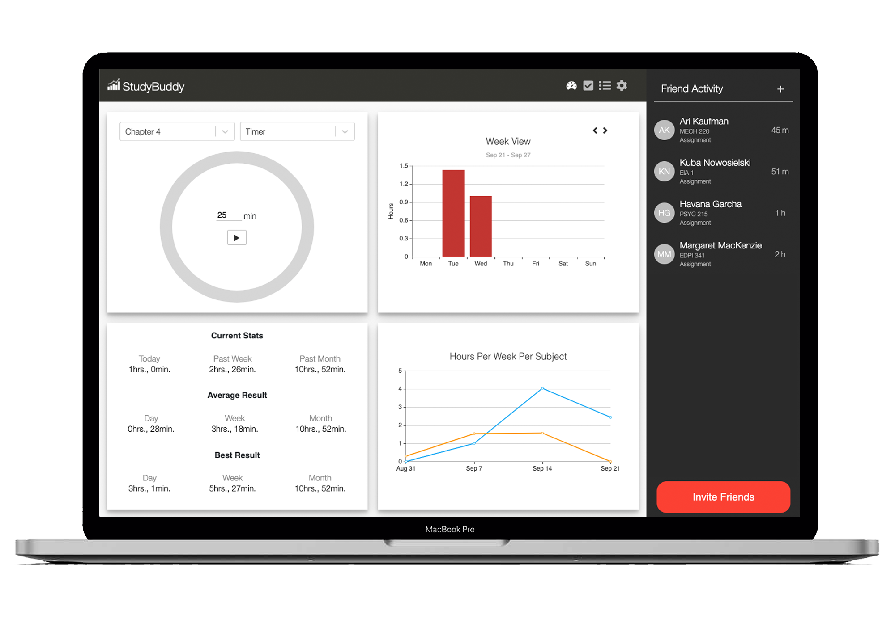
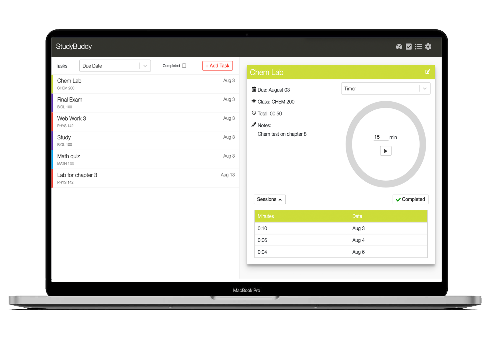
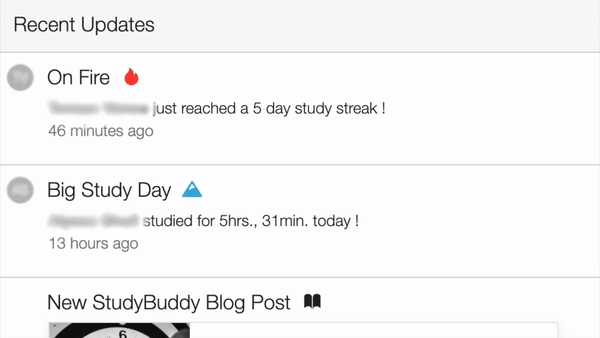
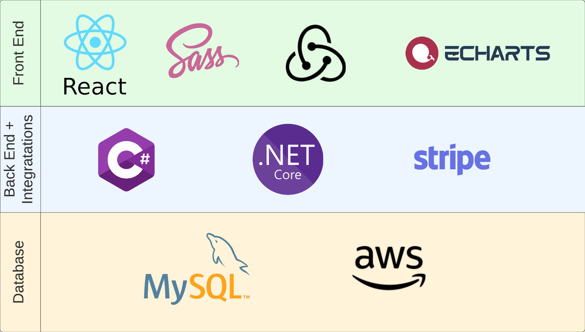
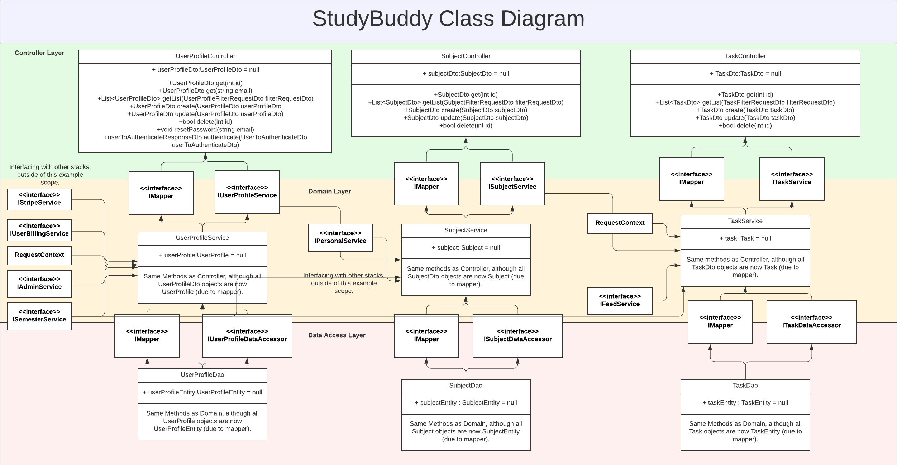
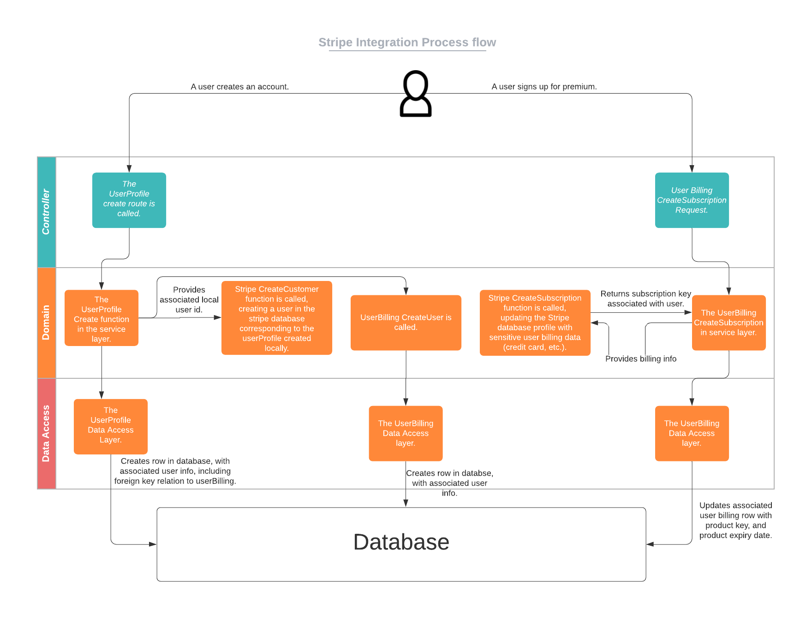
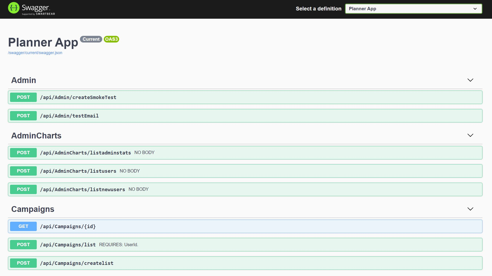

# Table of Contents
[1 Product Gallery](#Product-Gallery)  
[2 Technical Specifics](#Technical-Specifics)  
[2.1 Technical Diagrams](#Technical-Diagrams)  
[2.2 Swagger Screenshots](#Swagger-Screenshots)  
[2.3 Notable Design Decisions](#Notable-Design-Decisions)  
[3 Business Case](#Business-Case)  
[3.1 Video Pitch](#Video-Pitch)  

# Overview

We created a web application that solves two problems for students. Primarily, it allows students to stay connected with their friends while studying from home through online schooling, and secondly, provides a tool that will analyze their study habits to improve their productivity.

Students were forced to study remotely through COVID. With StudyBuddy, we hoped to create a virtual library environment, where students can see when their other friends are actively studying, and the courses that their friends are taking. Moreover, solutions are provided for students to stay on track through the semesters, as it was challenging for most with online school.

# Product Gallery
Below is a gallery of some images and videos of the hosted web application.

The images below shows the dashboard along with the friends tab. The dashboard would provide analytics for all students on their studying, and a mechanism for them to start a study session using the quick timer. The friends tab would display their list of friends on the application, and show when their friends were last studying, or if they are actively studying.

The second image shows the tasks tab. This is where students could create tasks, see the sessions they have worked on each task, and start a time for their specific tasks if they wish. The time spent on their tasks would then be factored into the dashboard analytics shown above.

  | 
 --- | ---

The video below runs through the view one may see when accessing the web application from mobile. The front end (within a seperate repo) was designed to accomodate varying screen sizes. All data is dynamically pulled from the backend using JSON routes.

Finally, below we see the feed. This would allow users to see their study streaks and milestones, along with those of their friends. 

# Technical Specifics
The backend was coded in C#, using DotNetCore. Classes were broken up based on the database structure, whereby each object would correspond to a data table in the mySQL database. Each of these classes would offer a CRUD stack along with listing methods.

The file structure of the API was broken up into 3 layers. The controller layer, the domain layer, and the data access layer. The data access layer would purely be responsible for data retrieival, and would contain the sql statements that would be passed into the database. The domain layer would be the communication point between stacks. For instance, if another stack (for instance the charting service) required information from other data tables, the communication would be done on the domain layer. Finally, the controller layer would surface all routes that would be available to the front end. This layer would also be responsible for all logic surrounding the swagger, and any authorization flags that would be reuqired to call each respective route.

## Technical Diagrams
To better illustrate the technologies used in this API, the following diagrams were created to communicate some key components of the design:

### Tech Stack
The first diagram, shown below, illustrates the entire tech stack of the application. It all languages and services used for the implementation, for both the front end (seperate repo), and back end (the current repo).

### Class Diagram
The first diagram shown below, is a class diagram. The API is far too large to include the specifics of every stack. Therefore, this diagram illustrates one section of the API. it shows the relation between UserProfiles, Subjects, and Tasks. 

There are a few key takeaways from this diagram. Namely:
* The data flows from parent to child object, along the domain layer. This avoids circular dependencies.
* Interfaces are used to expose the correct methods at each level.
* Classes are mirrored at every level of depth, and the mapping interface provides communication between each level. This leads to better data protection.

### Stripe Integration Process Flow
There were many integrations used in the implementation of this API. Most notably, a key integration was with Stripe to help serve the premium user functionality. As a startup, my co-founder and I were uncomfortable storing sensitive credit card information and user data in our local database. The effort that would be spent to ensure security was not time best spent.

Thus, we decided to leverage Stripe's open API and services to store sensitive user billing data, for those who wished to sign up for premium features. The process flow diagram illustrates a low fidelity flow of the integration. The flow shows two key processes: the creation of the user database rows and how the the foreign keys are stored, along with the initialization of a subscription itself. 

### AWS Infrastructure

## Swagger Screenshots

## Notable Design Decisions

# Business Case
## Video Pitch
Below, is a video pitch we presented at the QSS Startup Summit. Within this video, all details regarding our business case are thoroughly explained.

Access this pitch recording using the link below:

https://www.youtube.com/watch?v=sSAh3a2N_yQ

Hope you enjoy!

